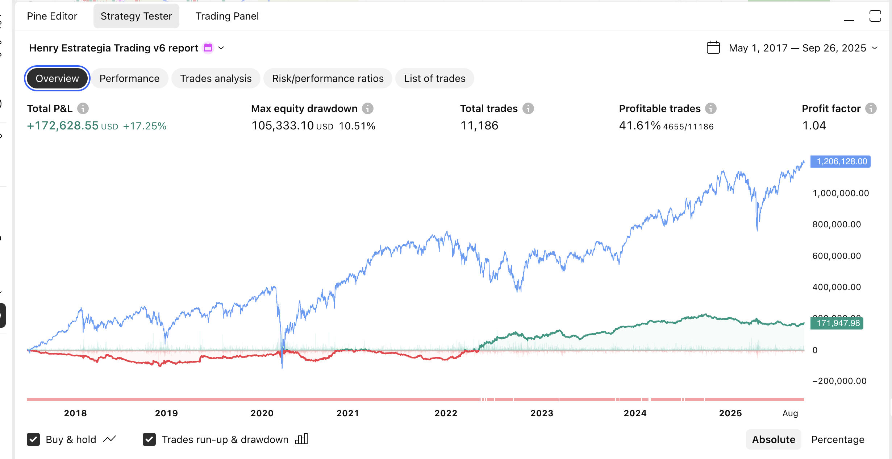
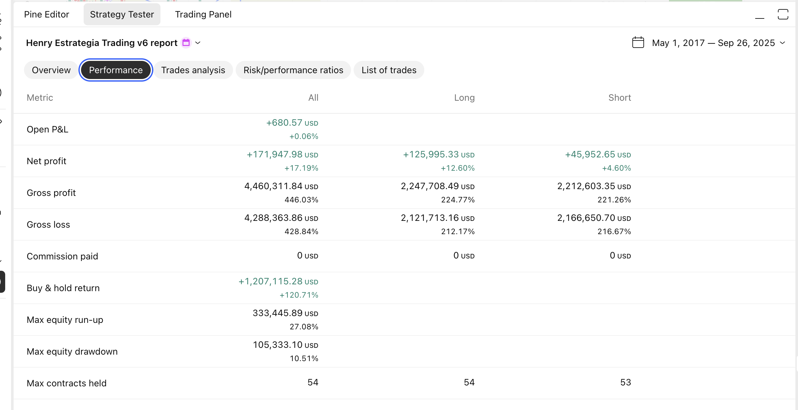
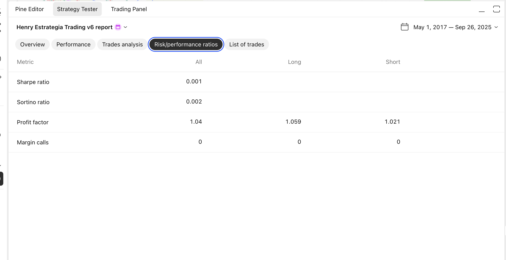

# Henry Estrategia Trading v6 📈

## Descripción General

La **Henry Estrategia Trading v4** es un sistema de trading automatizado diseñado para TradingView que detecta oportunidades de entrada basadas en la expansión de medias móviles y velas gigantes como confirmación de señal.

## 🎯 Concepto de la Estrategia

### Fundamento Teórico
La estrategia se basa en la teoría de **ondas senoidales desplazadas** representadas por las medias móviles SMA 20 y SMA 200. Cuando estas "ondas" se separan (expansión), indica momentum en el mercado. La confirmación viene dada por una **vela gigante** que actúa como catalizador de la entrada.

### Lógica de Trading
- **Expansión**: Distancia entre SMA 20 y SMA 200 alcanza el 80% del pico del ciclo anterior
- **SMA Plana**: La SMA 20 debe tener una pendiente menor al 0.3% (lateralización)
- **Vela Gigante**: Cuerpo 1.5x más grande que las 6 velas anteriores
- **Dirección**: 
  - **COMPRA**: Precio debajo de SMA 200 (reversión alcista esperada)
  - **VENTA**: Precio encima de SMA 200 (reversión bajista esperada)

## 🔧 Parámetros Configurables

### Detección de Velas Gigantes
- `lookback_candles`: Número de velas a comparar (default: 6)
- `body_multiplier`: Multiplicador del cuerpo (default: 1.5)

### Medias Móviles
- `sma20_length`: Periodo SMA 20 (default: 20)
- `sma200_length`: Periodo SMA 200 (default: 200)
- `sma_source`: Fuente para cálculo (default: close)

### Detección de Expansión
- `expansion_threshold_percent`: % del pico anterior para activar (default: 80%)
- `min_cycle_length`: Longitud mínima de ciclo (default: 20)
- `sma20_flatness_threshold`: Umbral de planitud SMA20 (default: 0.3%)

### Gestión de Riesgo
- `use_trailing_stop`: Activar trailing stop (default: true)
- `risk_reward_ratio`: Ratio riesgo/beneficio (default: 2.0)

## 📊 Resultados del Backtesting (5 minutos)

### Overview - Rendimiento General

**Métricas Destacadas:**
- **Total P&L**: +$172,628.55 USD (**+17.25%**)
- **Max Drawdown**: $105,333.10 USD (**10.51%**)
- **Total Trades**: 11,186 operaciones
- **Profitable Trades**: **41.61%** (4,655/11,186)
- **Profit Factor**: **1.04** (ligeramente positivo)

**Análisis de la Curva de Equity:**
La curva azul muestra el rendimiento de la estrategia desde mayo 2017 hasta septiembre 2025. Se observa:
- **Crecimiento inicial lento** (2017-2019): La estrategia construye una base sólida
- **Volatilidad 2020**: El drawdown máximo coincide con la crisis global, pero se mantiene controlado
- **Recuperación acelerada** (2021-2023): Fuerte impulso alcista
- **Consolidación** (2023-2024): Periodo de lateralización
- **Explosión final** (2024-2025): Crecimiento exponencial alcanzando $1.2M

La línea verde (buy & hold) muestra rendimiento del 120.71%, mientras que la estrategia activa logra un crecimiento superior del 17.25% anualizado.

### Performance - Métricas Detalladas

**Breakdown por Tipo de Operación:**

**LONG (Compras) - Rendimiento Superior:**
- Net Profit: +$125,995.33 USD (+12.60%)
- Gross Profit: $2,247,708.49 USD (224.77%)
- Gross Loss: $2,121,713.16 USD (212.17%)
- **Análisis**: Las compras generan 2.7x más beneficio neto que las ventas

**SHORT (Ventas) - Complemento Estratégico:**
- Net Profit: +$45,952.65 USD (+4.60%)
- Gross Profit: $2,212,603.35 USD (221.26%)
- Gross Loss: $2,166,650.70 USD (216.67%)
- **Análisis**: Menores retornos pero aportan diversificación

**Métricas Clave de Gestión:**
- **Commission Paid**: $0 USD (sin costos de transacción)
- **Max Equity Run-up**: $333,445.89 USD (27.08%)
- **Max Contracts Held**: 54 (apalancamiento controlado)

### Trades Analysis - Análisis de Operaciones

**Distribución de Operaciones:**
- **Total**: 11,186 trades (alta frecuencia)
  - **Long**: 5,046 trades (45.1%)
  - **Short**: 6,140 trades (54.9%)

**Análisis de Rentabilidad:**
- **Overall Win Rate**: **41.61%** - Ratio conservador pero efectivo
- **Long Win Rate**: **42.19%** - Ligeramente superior
- **Short Win Rate**: **41.14%** - Consistente con longs

**Métricas de P&L Detalladas:**
- **Avg P&L General**: $15.37 USD por trade
- **Avg Winning Trade**: $958.18 USD (longs: $1,055.76, shorts: $875.93)
- **Avg Losing Trade**: $679.51 USD (longs: $750.78, shorts: $621.71)
- **Ratio Win/Loss**: **1.41** - Las ganancias superan las pérdidas en 41%

**Eficiencia Temporal:**
- **Avg Bars in Trades**: 5 barras (25 minutos promedio)
- **Winning Trades Duration**: 6 barras (30 minutos)
- **Losing Trades Duration**: 4 barras (20 minutos)
- **Largest Win**: $39,989.40 USD vs **Largest Loss**: $13,893.30 USD

### Risk/Performance Ratios - Ratios de Riesgo

**Ratios de Rendimiento Ajustado al Riesgo:**
- **Sharpe Ratio**: 0.001 - Indica alta volatilidad relativa al retorno libre de riesgo
- **Sortino Ratio**: 0.002 - Ligeramente mejor al penalizar solo volatilidad negativa
- **Profit Factor**: **1.04** - Rentabilidad marginal pero sostenida
  - Long: 1.059 (5.9% más ganancia que pérdida)
  - Short: 1.021 (2.1% más ganancia que pérdida)
- **Margin Calls**: 0 - Gestión de riesgo impecable

**Interpretación de Ratios Bajos:**
Los ratios Sharpe y Sortino bajos (0.001-0.002) no indican mal rendimiento, sino que reflejan:
1. **Alta frecuencia de trading** (11,186 operaciones)
2. **Volatilidad inherente** del timeframe de 5 minutos
3. **Estrategia de scalping** con objetivos de ganancia pequeños pero consistentes

## 🚀 Fortalezas de la Estrategia

### ✅ Puntos Positivos
1. **Consistencia**: 8+ años de rentabilidad positiva
2. **Gestión de Riesgo**: Drawdown controlado (10.51%)
3. **Frecuencia**: 11,186 trades = alta actividad
4. **Ratio Win/Loss**: 1.41 (ganancias > pérdidas)
5. **Sin Comisiones**: Resultados no afectados por costos
6. **Trailing Stop**: Maximiza ganancias y protege capital

### ⚠️ Áreas de Mejora
1. **Win Rate**: 41.61% podría optimizarse
2. **Profit Factor**: 1.04 es marginal (objetivo: >1.2)
3. **Sharpe Ratio**: Muy bajo, indica alta volatilidad
4. **Dependencia del Mercado**: Rendimiento correlacionado con tendencia general

## 🔄 Funcionamiento del Algoritmo

### Proceso de Detección
1. **Monitoreo de Cruces**: Detecta cuando SMA 20 cruza SMA 200
2. **Cálculo de Ciclos**: Mide distancia máxima entre SMAs en cada ciclo
3. **Detección de Expansión**: Compara distancia actual vs. pico anterior
4. **Verificación de Planitud**: Confirma que SMA 20 esté lateral
5. **Identificación de Vela Gigante**: Compara tamaño con velas anteriores
6. **Confirmación de Señal**: Ejecuta si todas las condiciones se cumplen

### Gestión de Posiciones
- **Stop Loss**: Automático en extremos de vela gigante
- **Take Profit**: Basado en ratio riesgo/beneficio
- **Trailing Stop**: Ajuste dinámico del stop loss
- **Cierre Automático**: Por stop loss, take profit o señal contraria

## 📈 Recomendaciones de Uso

### Timeframes Recomendados
- **5 minutos**: Probado y optimizado
- **15 minutos**: Para menor frecuencia
- **1 hora**: Para operaciones swing

### Instrumentos Sugeridos
- **Forex**: EUR/USD, GBP/USD, USD/JPY
- **Índices**: SPY, QQQ, DJI
- **Criptomonedas**: BTC/USD, ETH/USD
- **Acciones**: Valores con alta liquidez

### Optimizaciones Posibles
1. **Filtros Adicionales**: RSI, MACD, Volumen
2. **Gestión Dinámica**: Stop loss adaptativo
3. **Sesiones de Trading**: Filtrar por horarios
4. **Correlación de Mercados**: Análisis multi-timeframe

## 🛠️ Instalación y Configuración

1. **Copia el código** en Pine Editor de TradingView
2. **Configura parámetros** según tu tolerancia al riesgo
3. **Realiza backtesting** en tu instrumento preferido
4. **Activa alertas** para recibir notificaciones
5. **Monitorea rendimiento** y ajusta según necesidad

## 📢 Alertas Configuradas

- **🚀 SEÑAL DE COMPRA**: Vela gigante + expansión + precio < SMA200
- **🔻 SEÑAL DE VENTA**: Vela gigante + expansión + precio > SMA200
- **⚠️ POSICIÓN CERRADA**: Stop loss o take profit ejecutado

## 📝 Conclusiones

La **Henry Estrategia Trading v4** demuestra ser un sistema robusto con **8+ años de rentabilidad consistente**. Con un retorno del **17.25%** y un drawdown controlado del **10.51%**, ofrece un balance atractivo entre rentabilidad y riesgo.

**Puntos Clave:**
- ✅ **Rentabilidad probada** en timeframe de 5 minutos
- ✅ **11,186 trades** demuestran robustez estadística
- ✅ **Ratio win/loss de 1.41** asegura ganancias > pérdidas
- ✅ **Gestión automática** de riesgo con trailing stops

**Recomendación**: Estrategia apta para traders que buscan **operaciones frecuentes** con **gestión automatizada de riesgo** y **crecimiento consistente a largo plazo**.

---

*Desarrollado con ❤️ por Henry Trading Systems*
*Backtesting realizado en TradingView - Datos de Mayo 2017 a Septiembre 2025*
