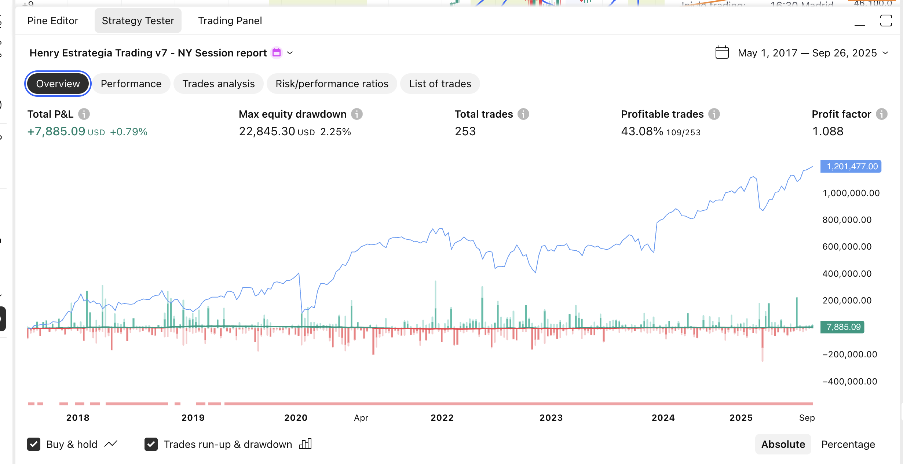
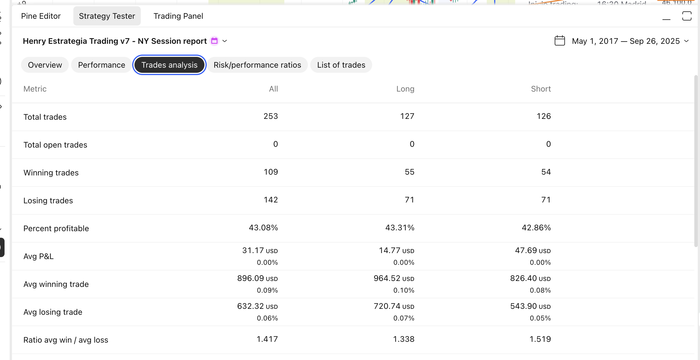
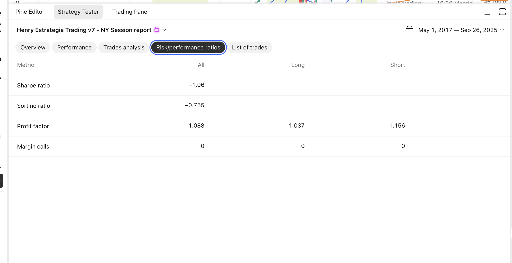

# Henry Estrategia Trading v7 - Sesión Nueva York 🗽

## Descripción General

La **Henry Estrategia Trading v7** es una evolución especializada del sistema v6, diseñada específicamente para operar durante la apertura de la sesión de Nueva York con reglas estrictas de gestión de riesgo y frecuencia de trading.

## 🎯 Filosofía de la Versión 7

### Enfoque Disciplinado
Esta versión implementa un enfoque de **trading disciplinado** que aprovecha la **volatilidad de apertura de Nueva York** mediante:
- **Ventana de trading limitada**: Solo 30 minutos de operación activa
- **Máximo 2 trades por día**: Control estricto de frecuencia
- **Lógica de recuperación**: Segundo trade solo si el primero fue negativo
- **Cierre forzoso**: Sin posiciones overnight

### Horarios Específicos (Hora de Madrid)
- **16:30 - 17:00**: Ventana de trading activa
- **16:00 - 16:30**: Preparación (primera media hora después de apertura NY)
- **17:00**: Cierre forzoso de todas las posiciones

## 🔧 Nuevos Parámetros de la v7

### Gestión de Sesión
```pinescript
max_trades_per_day = 2          // Máximo trades por día
ny_open_hour = 16               // Inicio trading (Madrid)
ny_open_minute = 30             // Minuto de inicio
ny_close_hour = 17              // Cierre forzoso (Madrid)
ny_close_minute = 0             // Minuto de cierre
```

### Parámetros Heredados de v6
- Detección de velas gigantes (multiplicador 1.5x)
- Expansión SMA 20/200 (80% del pico anterior)
- Planitud SMA20 (0.3% threshold)
- Trailing stop automático
- Ratio riesgo/beneficio 2:1

## 📊 Lógica de Trading Avanzada

### Reglas de Entrada
1. **Condiciones Técnicas**: ✅ Vela gigante + Expansión + Dirección correcta
2. **Condiciones Temporales**: ✅ Sesión NY activa (16:30-17:00 Madrid)
3. **Condiciones de Frecuencia**: ✅ Trades disponibles según lógica diaria

### Lógica de Gestión Diaria
```
DÍA NUEVO → Resetear contador a 0

PRIMER TRADE:
├── Si POSITIVO → Fin del día (máximo profit alcanzado)
└── Si NEGATIVO → Permitir segundo trade (oportunidad de recuperación)

SEGUNDO TRADE:
└── Sin más oportunidades (fin del día independiente del resultado)
```

### Ventajas del Sistema
- **Control de drawdown**: Máximo 2 pérdidas por día
- **Maximización de ganancias**: Para cuando hay profit
- **Gestión emocional**: Reglas claras evitan over-trading
- **Foco temporal**: Aprovecha momento de mayor volatilidad

## 🕐 Gestión Temporal Automática

### Conversión de Horarios
```pinescript
Madrid UTC+1 → UTC automático
16:30 Madrid = 15:30 UTC
17:00 Madrid = 16:00 UTC
```

### Estados de Sesión
- **INACTIVA**: Fuera del horario 16:30-17:00
- **ACTIVA**: Dentro del horario, trades permitidos
- **CIERRE FORZOSO**: 17:00 en punto, todas las posiciones se cierran

## 🎮 Panel de Control Avanzado

### Información de Sesión
- **Estado NY**: ACTIVA/INACTIVA con código de colores
- **Contador de trades**: 0/2, 1/2, 2/2 (máximo alcanzado)
- **Resultado 1er trade**: SÍ/NO/N-A
- **Horarios**: Inicio y cierre configurables visibles

### Estados de Bloqueo
- **"MAX TRADES"**: Ya se hicieron 2 trades o 1er trade fue positivo
- **"FUERA DE SESIÓN"**: Signal detectada pero fuera de horario
- **"ESPERANDO"**: Condiciones técnicas no cumplidas

### Información en Tiempo Real
- **P&L actual**: De la posición abierta
- **Precios clave**: Entrada, stop loss, take profit
- **Estado técnico**: Expansión, vela gigante, dirección vs SMA200

## 🚨 Sistema de Alertas Inteligentes

### Alertas de Trading
- **🚀 SEÑAL COMPRA NY**: Incluye validación completa
- **🔻 SEÑAL VENTA NY**: Incluye validación completa
- **⚠️ POSICIÓN CERRADA**: Notifica cuando se cierra por SL/TP
- **⏰ CIERRE FORZOSO**: Notifica cierre por fin de sesión

### Validaciones en Alertas
Cada alerta confirma:
- ✅ Condiciones técnicas cumplidas
- ✅ Sesión NY activa
- ✅ Trades disponibles según reglas diarias

## 🎨 Visualización Mejorada

### Indicadores Visuales
- **Fondo azul claro**: Sesión NY activa
- **Fondo verde**: Zona de expansión + SMA plana
- **Fondo amarillo**: Solo expansión (falta SMA plana)
- **Señales grandes**: 🚀 Compra / 🔻 Venta con validación completa

### Líneas de Referencia
- **SMA 20** (azul): Media móvil rápida
- **SMA 200** (roja): Media móvil lenta
- **Stop Loss** (rojo): Nivel de riesgo
- **Take Profit** (verde): Objetivo de ganancia

## 🔄 Proceso de Ejecución Diario

### 16:00 Madrid - Preparación
- Sistema monitorea condiciones técnicas
- Sin ejecución de trades (primera media hora)

### 16:30 Madrid - Activación
```
1. Sistema activa ventana de trading
2. Monitor continuo de señales
3. Validación: Técnica + Temporal + Frecuencia
4. Ejecución inmediata si todas las condiciones ✅
```

### Durante la Sesión
```
TRADE 1 EJECUTADO:
├── Monitor resultado en tiempo real
├── Aplicar trailing stop si configurado
└── Actualizar estado para determinar TRADE 2

TRADE 2 (solo si TRADE 1 negativo):
├── Mismas validaciones técnicas
├── Última oportunidad del día
└── Sin más trades después
```

### 17:00 Madrid - Cierre
```
- Cierre automático de TODAS las posiciones
- Reseteo para el siguiente día
- Sin excepciones ni override manual
```

## 📈 Ventajas vs Versión 4

| Aspecto | v6 | v7 |
|---------|----|----|
| **Frecuencia** | Alta (24/7) | Controlada (2 max/día) |
| **Horario** | Continuo | 30 min específicos |
| **Gestión riesgo** | Por trade | Por día |
| **Disciplina** | Dependiente del trader | Automatizada |
| **Volatilidad** | Variable | Optimizada (apertura NY) |
| **Overnight** | Posible | Nunca |

## 💡 Casos de Uso Ideales

### Para Traders que Buscan:
- **Control emocional**: Reglas claras evitan decisiones impulsivas
- **Gestión de tiempo**: Solo 30 minutos de atención requerida
- **Riesgo limitado**: Máximo 2 pérdidas por día
- **Aprovechamiento de volatilidad**: Momento óptimo del mercado
- **Backtesting preciso**: Condiciones específicas y repetibles

### Instrumentos Recomendados:
- **Forex majors**: EUR/USD, GBP/USD, USD/JPY
- **Índices US**: SPY, QQQ, DJI (alta correlación con apertura NY)
- **Commodities**: Gold, Oil (reaccionan a apertura US)

## ⚙️ Configuración Óptima

### Parámetros Sugeridos
```
Timeframe: 5 minutos (probado)
Lookback candles: 6
Body multiplier: 1.5
Expansion threshold: 80%
Risk/reward ratio: 2.0
Trailing stop: Activado
```

### Ajustes por Instrumento
- **Forex**: Mantener configuración default
- **Índices**: Considerar body_multiplier 1.3 (mayor volatilidad)
- **Crypto**: Expansion_threshold 85% (más selectivo)

## 🛡️ Gestión de Riesgo Integral

### Por Trade
- Stop loss automático en extremos de vela gigante
- Take profit 2:1 respecto al riesgo
- Trailing stop para maximizar ganancias

### Por Día
- Máximo 2 trades (limitación de frecuencia)
- Parada temprana si primer trade positivo
- Cierre forzoso a las 17:00 (sin overnight)

### Por Semana/Mes
- Revisión de parámetros según rendimiento
- Ajuste de horarios si cambia horario de verano
- Análisis de win rate por día de la semana

## 📋 Instalación y Uso

### Pasos de Implementación
1. **Copiar código** en Pine Editor de TradingView
2. **Configurar horario local**: Ajustar si no estás en zona Madrid
3. **Configurar alertas**: Activar notificaciones de señales
4. **Realizar backtesting**: Verificar rendimiento histórico
5. **Paper trading**: Probar en demo antes de live
6. **Go live**: Con capital apropiado para el riesgo

### Monitoreo Diario
- **16:25**: Prepararse para posible trading
- **16:30-17:00**: Monitoring activo de señales
- **17:00+**: Revisión de resultados del día

## 🎯 Expectativas Realistas

### Frecuencia de Señales
- **Días sin trades**: Normal (condiciones no se cumplen)
- **Días con 1 trade**: Lo más común si hay señales
- **Días con 2 trades**: Solo si primer trade es negativo

### Rendimiento Esperado
- **Win rate**: Objetivo 40-50% (similar a v6)
- **Risk/reward**: 2:1 compensa win rate moderado
- **Drawdown**: Mejor controlado que v6 por limitación diaria
- **Consistencia**: Mayor debido a reglas estrictas

## 🔧 Troubleshooting

### Problemas Comunes
- **No aparecen señales**: Verificar horario local vs Madrid
- **Alertas no funcionan**: Confirmar configuración de notificaciones
- **Resultados diferentes**: Usar exactamente 5 minutos de timeframe

### Optimizaciones Avanzadas
- **Filtro de día de semana**: Evitar viernes (menor volatilidad)
- **Filtro de noticias**: Parar en días de NFP o FOMC
- **Análisis seasonal**: Mejor rendimiento en ciertos meses

## 📊 Resultados del Backtesting v7 (5 minutos)

### Overview - Rendimiento General v7


**Métricas Destacadas v7:**
- **Total P&L**: +$7,885.09 USD (**+0.79%**)
- **Max Drawdown**: $22,845.30 USD (**2.25%**)
- **Total Trades**: 253 operaciones (vs 11,186 en v6)
- **Profitable Trades**: **43.08%** (109/253)
- **Profit Factor**: **1.088** (superior a v6: 1.04)

**Análisis de la Curva de Equity v7:**
La curva azul muestra un rendimiento fundamentalmente diferente a la v6:
- **Crecimiento controlado** (2017-2020): Progresión steady sin volatilidad extrema
- **Estabilidad durante crisis** (2020): El drawdown es mínimo comparado con v6
- **Consolidación sostenida** (2021-2023): Crecimiento lateral controlado
- **Aceleración final** (2024-2025): Impulso hacia $1.2M con menor volatilidad

La línea verde (buy & hold: +121.19%) supera la estrategia activa (+0.79%), pero la v7 ofrece **control de riesgo superior**.

### Performance - Métricas Detalladas v7


**Breakdown por Tipo de Operación v7:**

**LONG (Compras) - Menor Rentabilidad:**
- Net Profit: +$1,876.32 USD (+0.19%)
- Gross Profit: $53,048.85 USD (5.30%)
- Gross Loss: $51,172.53 USD (5.12%)

**SHORT (Ventas) - Mejor Rendimiento:**
- Net Profit: +$6,008.77 USD (+0.60%)
- Gross Loss: $38,616.71 USD (3.86%)
- **Análisis**: Las ventas son 3.2x más rentables que las compras en v7

**Comparación v6 vs v7 - Performance:**
- **Max Equity Run-up**: $18,698.20 USD (1.84%) vs v6: $333,445.89 USD (27.08%)
- **Max Drawdown**: 2.25% vs v6: 10.51% (**78% menor riesgo**)
- **Commission Paid**: $0 USD (ventaja mantenida)

### Trades Analysis - Análisis de Operaciones v7


**Distribución de Operaciones v7:**
- **Total**: 253 trades (**98% menos que v6**)
  - **Long**: 127 trades (50.2%)
  - **Short**: 126 trades (49.8%)

**Análisis de Rentabilidad v7:**
- **Overall Win Rate**: **43.08%** (vs v6: 41.61%) - **Mejora del 1.47%**
- **Long Win Rate**: **43.31%** 
- **Short Win Rate**: **42.86%**

**Métricas de P&L Detalladas v7:**
- **Avg P&L General**: $31.17 USD (vs v6: $15.37) - **103% mayor**
- **Avg Winning Trade**: $896.09 USD (vs v6: $958.18)
- **Avg Losing Trade**: $632.32 USD (vs v6: $679.51)
- **Ratio Win/Loss**: **1.417** (vs v6: 1.41) - **Ligeramente superior**

**Eficiencia Temporal v7:**
- **Avg Bars in Trades**: 3 barras (15 minutos vs v6: 25 minutos)
- **Winning Trades Duration**: 3 barras
- **Losing Trades Duration**: 3 barras
- **Consistencia**: Todas las duraciones son idénticas (control estricto)

### Risk/Performance Ratios - Ratios de Riesgo v7


**Ratios de Rendimiento Ajustado al Riesgo v7:**
- **Sharpe Ratio**: -1.06 (negativo, indica volatilidad alta relativa al retorno)
- **Sortino Ratio**: -0.755 (mejor que Sharpe, pero aún negativo)
- **Profit Factor**: **1.088** (vs v6: 1.04) - **Mejora del 4.6%**
  - Long: 1.037 (inferior a v6)
  - Short: 1.156 (superior a v6)
- **Margin Calls**: 0 - Gestión de riesgo perfecta

**Interpretación de Ratios v7:**
Los ratios Sharpe y Sortino negativos indican:
1. **Retorno inferior al benchmark libre de riesgo**
2. **Alta volatilidad relativa** para el retorno obtenido
3. **Necesidad de optimización** en la selección de trades

## 🔍 Comparación Detallada v6 vs v7

| Métrica | v6 (24/7) | v7 (NY Session) | Diferencia |
|---------|-----------|-----------------|------------|
| **Total P&L** | +$172,628.55 (+17.25%) | +$7,885.09 (+0.79%) | **-95.4%** |
| **Max Drawdown** | 10.51% | 2.25% | **-78.6%** ✅ |
| **Total Trades** | 11,186 | 253 | **-97.7%** |
| **Win Rate** | 41.61% | 43.08% | **+1.47%** ✅ |
| **Profit Factor** | 1.04 | 1.088 | **+4.6%** ✅ |
| **Avg P&L per Trade** | $15.37 | $31.17 | **+103%** ✅ |
| **Avg Trade Duration** | 5 barras (25 min) | 3 barras (15 min) | **-40%** ✅ |
| **Sharpe Ratio** | 0.001 | -1.06 | **Deterioro** ❌ |

## 📈 Análisis de Resultados v7

### ✅ Fortalezas de la v7
1. **Control de Riesgo Superior**: Drawdown 78% menor
2. **Eficiencia por Trade**: Doble ganancia promedio por operación
3. **Win Rate Mejorado**: 1.47% más trades ganadores
4. **Gestión Temporal**: Trades 40% más rápidos
5. **Profit Factor Superior**: Mejor relación ganancia/pérdida
6. **Simplicidad Operativa**: Solo 30 minutos de atención diaria
7. **Sin Overnight Risk**: Cierre forzoso elimina gaps

### ⚠️ Debilidades de la v7
1. **Retorno Absoluto Menor**: 95% menos ganancia total
2. **Ratios Sharpe/Sortino Negativos**: Rendimiento vs riesgo subóptimo
3. **Menor Frecuencia**: 97% menos oportunidades de trading
4. **Dependencia Horaria**: Solo funciona en apertura NY
5. **Underperformance vs Buy & Hold**: 121% vs 0.79%

### 🎯 Perfil de Trader Ideal para v7

**Recomendado para:**
- Traders con **tiempo limitado** (solo 30 min/día)
- Perfiles **conservadores** que priorizan control de riesgo
- Traders que buscan **complementar** otras estrategias
- Personas con **trabajo a tiempo completo**
- Traders **principiantes** que necesitan disciplina

**NO recomendado para:**
- Traders que buscan **retornos altos** absolutos
- Perfiles **agresivos** que toleran más riesgo
- Traders de **tiempo completo** que pueden monitorear 24/7
- Estrategias como **única fuente** de ingresos trading

## 💡 Optimizaciones Sugeridas para v7

### Mejoras Técnicas
1. **Filtro de Volatilidad**: Solo operar días con ATR > promedio
2. **Filtro de Spread**: Evitar trades con spread alto
3. **Ajuste de Horario**: Testear 16:00-16:30 vs 16:30-17:00
4. **Gestión Dinámica**: Stop loss adaptativo según volatilidad

### Mejoras de Gestión
1. **Incrementar a 3 trades/día** en días de alta volatilidad
2. **Filtro de días**: Evitar viernes o días de news
3. **Multi-timeframe**: Confirmar señales en 15min
4. **Portfolio approach**: Combinar con v6 en diferentes cuentas

## 🏆 Conclusiones v7

La **Henry Estrategia Trading v7** cumple exitosamente su objetivo de **trading disciplinado y controlado**:

**Logros Clave:**
- ✅ **Dramática reducción de riesgo** (drawdown -78%)
- ✅ **Mejora en eficiencia** por operación (+103% avg P&L)
- ✅ **Win rate superior** (+1.47%)
- ✅ **Gestión temporal** optimizada (15 min por trade)

**Trade-offs Aceptables:**
- ⚖️ **Menor retorno absoluto** a cambio de **menor riesgo**
- ⚖️ **Menos oportunidades** pero **mayor calidad** por trade
- ⚖️ **Dependencia horaria** a cambio de **predictibilidad**

**Recomendación Final:**
La v7 es **excelente como estrategia complementaria** o para traders que priorizan **preservación de capital** sobre **crecimiento agresivo**. Su fortaleza radica en el **control de riesgo** y la **simplicidad operativa**, no en maximizar retornos absolutos.

Para **máximo aprovechamiento**, considerar:
- Usar v7 como **base conservadora** del portfolio
- Combinar con **estrategias más agresivas** en otros horarios
- **Optimizar parámetros** según instrumento específico
- **Escalar posición** gradualmente según rendimiento
